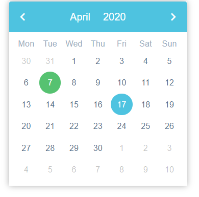
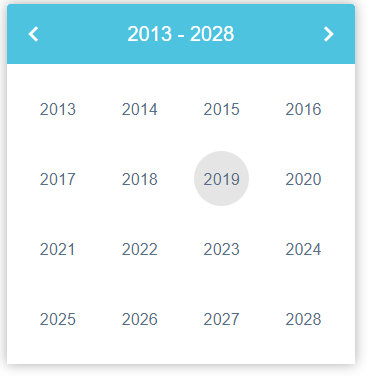

# ngdatepicker (Angular Datepicker)

a simple and easy to use datepicker

NOTE: in order to update the chosen date in the datepicker while its open, just changing it and marking for check wont cut it, the recommended approach is to manually dispatch a click event on the input field the directive is on - by doing that we avoid the necessity of having a change detection different than OnPush or invoking markForCheck in ngAfterViewChecked which turns out to cause a bottleneck - so manually dispatching an event is a small sacrifice

